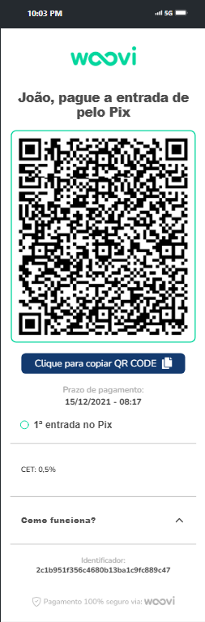

## 💻 Deploy

<a href="https://woovi-challenge-pied.vercel.app/">Clique aqui para ver o projeto</a>

## 📝 Description

The application provides a simplified experience for purchasing payments, offering flexible options through Pix and credit card installment. Developed with React and integrated with Material-UI (MUI), it allows users to choose between different payment methods, such as immediate payment via Pix with a 3% discount or installment up to 7 times on a credit card.

Key Features:
Pix Payment:

Immediate payment option with a 3% discount via Pix.
Intuitive interface with QR Code to facilitate the transaction.
Credit Card Installment:

Flexibility to split the payment into up to 7 installments on the credit card.
Clear details about each installment option and associated costs.
How It Works:
The user selects the desired payment method on the homepage.
Opting for Pix generates a QR Code to facilitate instant payment.
For installment payments, the user is guided through a simple process to enter card details and complete the transaction.
Benefits:
Ease of Use: User-friendly interface that simplifies the payment process.
Transparency: Clear details about costs and benefits of each payment option.
Security: Secure integration with payment platforms to protect user data.
Technologies Used:
React, Material-UI (MUI), and Context API for state management.
This application was developed to provide a smooth and transparent payment experience, tailored to modern needs for online purchasing and payment.

## 🔧 Installation

Installation via npm:

```bash
  git clone "https://github.com/rogervalentim/woovi-challenge.git"
  cd woovi-challenge
  npm install
```

## 🔌 How to Run

```bash
  npm run dev
```

## 📊 Technologies and Libraries Used

<ul>
<li>React</li>
<li>Vite</li>
<li>Context API</li>
<li>MUI</li>
<li>React Hook Form e Yup</li>
<li>Typescript</li>
</ul>

## 📸 Project Images

## Home


## Pix



## Card


